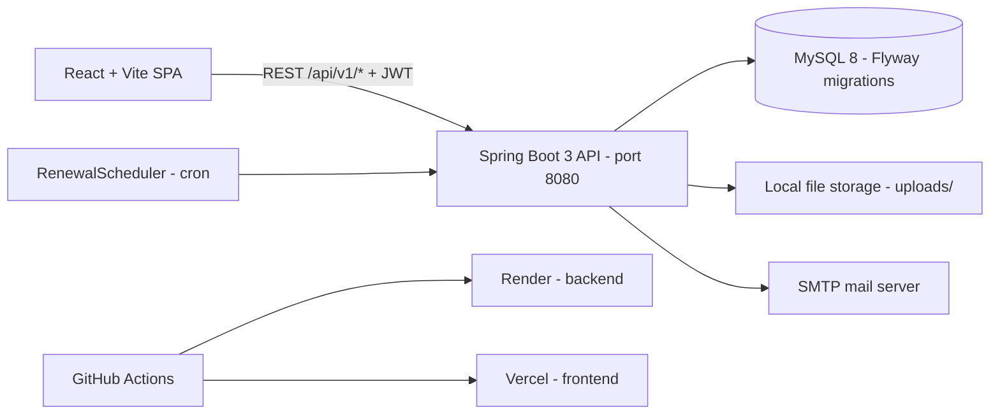

# Insurance Policy Management Platform

A full-stack platform for managing insurance policies end to end — policy catalogue, customer policies, premium payments, renewals with automated reminders, document storage with heuristic PDF extraction, notifications, and an admin back office.

## 2. Live Demo

- Frontend (Vercel): `https://<your-vercel-app>.vercel.app`
- Backend API (Render): `https://<your-render-service>.onrender.com`
- Health check: `GET https://<your-render-service>.onrender.com/api/health`
- Demo credentials (seeded admin): `admin@insurance.local` / `Admin@123`

> Replace the placeholder URLs above with the real deployment URLs.

## 3. Video Demo

- Demo video: `<link to demo video (YouTube/Loom)>`
- Suggested walkthrough: login as admin → browse policy catalogue → create a customer policy → record a premium payment → trigger a renewal → upload a policy document and preview heuristic extraction → check notifications.

## 4. Overview

Customers hold insurance policies bought from carriers (`insurance_companies`) against catalogue products (`policy_types`). The system tracks cover periods, premium payments, renewal requests, stored documents, and user notifications. A scheduled job scans for policies expiring soon and creates renewal reminders plus notifications. Admins get a dashboard, user/policy/renewal browsers, and an audit log. Documents (PDFs) can be uploaded per policy and run through a heuristic text/field extractor to pre-fill policy data.

## 5. Architecture Diagram



See [docs/diagrams/architecture.md](docs/diagrams/architecture.md), [docs/diagrams/er-diagram.dbml](docs/diagrams/er-diagram.dbml), and [docs/diagrams/class-diagram.md](docs/diagrams/class-diagram.md).

## 6. Tech Stack

Backend (`backend/`, artifact `com.insurance:platform`, Spring Boot `3.2.5`, Java `17`):

- Spring Web, Validation, Data JPA, Security (JWT via `jjwt` `0.12.6`), Mail, Scheduling
- MySQL (`mysql-connector-j`) + Flyway (`flyway-core`, `flyway-mysql`); H2 for tests
- springdoc-openapi `2.5.0` (Swagger UI), Lombok, Apache PDFBox `2.0.31`

Frontend (`frontend/`, `insurance-frontend` `1.0.0`):

- React `18`, React Router `6`, Axios, Bootstrap `5`, Vite `5` (dev server port `5173`, proxies `/api` → `http://localhost:8080`)

Infrastructure: GitHub Actions CI, Render (backend) + Vercel (frontend) hosting, cloud MySQL in production, local file storage + SMTP mail.

## 7. Features

- JWT auth (register/login/me) with customer + admin roles; seeded admin on startup
- Policy catalogue: insurance companies and policy types (CRUD, active/inactive)
- Customer policies: create/list/search, dashboard summary, update, delete
- Premium payments per policy + payment summary
- Renewals: upcoming/expiring lists, request renewal, complete renewal; daily scheduler creates reminders
- Documents: multipart upload per policy, download, delete, heuristic PDF extract-preview
- Notifications: list, unread count, mark read / mark all read
- Customer profile + self-service user endpoints (`/users/me`, `/profile`)
- Admin: dashboard stats, user/policy/renewal browsers, audit logs
- Audit logging of security-sensitive operations; Flyway-managed schema

## 8. Screenshots

- `docs/screenshots/login.png` — login page
- `docs/screenshots/dashboard.png` — customer dashboard + summary
- `docs/screenshots/policies.png` — policy list and search
- `docs/screenshots/renewals.png` — upcoming renewals
- `docs/screenshots/admin.png` — admin dashboard

> Screenshots live under `docs/screenshots/` (add them here).

## 9. Getting Started

Prerequisites: Java `17`, Maven `3.9+` (or use `./mvnw`), Node `20` + npm, MySQL `8`.

### 9.1 Create the MySQL 8 database

```sql
CREATE DATABASE IF NOT EXISTS insurance_dev
  CHARACTER SET utf8mb4 COLLATE utf8mb4_unicode_ci;
CREATE USER IF NOT EXISTS 'insurance'@'localhost' IDENTIFIED BY 'insurance';
GRANT ALL PRIVILEGES ON insurance_dev.* TO 'insurance'@'localhost';
FLUSH PRIVILEGES;
```

Flyway (`classpath:db/migration`, `ddl-auto: validate`) creates/migrates all tables automatically on startup.

### 9.2 Configure environment

```bash
cp .env.example .env
cp frontend/.env.example frontend/.env
# Edit values (DB_URL/DB_USERNAME/DB_PASSWORD, JWT_SECRET, mail, FRONTEND_URL/CORS_ALLOWED_ORIGINS)
```

For local dev with defaults (MySQL `root`/`root`, MailHog/Mailpit on `localhost:1025`), the out-of-the-box defaults work.

### 9.3 Run the backend

```bash
cd backend
./mvnw spring-boot:run
# API on http://localhost:8080, e.g. GET http://localhost:8080/api/health
```

### 9.4 Run the frontend

```bash
cd frontend
npm install
npm run dev
# App on http://localhost:5173 (proxies /api to http://localhost:8080)
```

## 10. Env Vars

| Variable | Used by | Default (dev) | Description |
|---|---|---|---|
| `SPRING_PROFILES_ACTIVE` | backend | `dev` | `dev` or `prod` profile |
| `DB_URL` | backend | `jdbc:mysql://localhost:3306/insurance_dev?...` | JDBC URL (MySQL 8) |
| `DB_USERNAME` | backend | `root` | DB user |
| `DB_PASSWORD` | backend | `root` | DB password |
| `JWT_SECRET` | backend | dev-only placeholder | 256-bit+ signing secret |
| `JWT_EXPIRATION` | backend | `86400000` | Token TTL in ms |
| `ADMIN_EMAIL` | backend | `admin@insurance.local` | Seeded admin email |
| `ADMIN_PASSWORD` | backend | `Admin@123` | Seeded admin password |
| `SEED_ADMIN` | backend | `true` | Seed admin on startup |
| `FILE_STORAGE_PATH` | backend | `./uploads` | Document storage dir |
| `APP_FILE_MAX_SIZE` | backend | `10MB` | Max upload size |
| `MAIL_HOST` | backend | `localhost` | SMTP host |
| `MAIL_PORT` | backend | `1025` | SMTP port (`587` in prod) |
| `MAIL_USERNAME` | backend | `` | SMTP user |
| `MAIL_PASSWORD` | backend | `` | SMTP password |
| `MAIL_FROM` | backend | `no-reply@insurance.local` | Sender address |
| `FRONTEND_URL` | backend | `http://localhost:5173` | Frontend origin |
| `CORS_ALLOWED_ORIGINS` | backend | `http://localhost:5173` | Allowed CORS origins |
| `SCHEDULER_CRON` | backend | `0 0 8 * * *` | Renewal scan schedule |
| `VITE_API_BASE_URL` | frontend | `http://localhost:8080` | Backend origin (frontend appends `/api`) |

Full template with comments: [.env.example](.env.example) and [frontend/.env.example](frontend/.env.example).

## 11. API Docs

Interactive docs (springdoc): `GET http://localhost:8080/swagger-ui.html` (OpenAPI JSON at `/v3/api-docs`).

Base path is `/api/v1` (health at `/api/health`). All endpoints except auth/health require `Authorization: Bearer <JWT>`.

| Method | Endpoint | Description |
|---|---|---|
| POST | `/api/v1/auth/register` | Register customer |
| POST | `/api/v1/auth/login` | Login, returns JWT |
| GET | `/api/v1/auth/me` | Current user |
| GET | `/api/v1/policies` | List/search policies |
| GET | `/api/v1/policies/dashboard-summary` | Policy stats summary |
| GET | `/api/v1/policies/{id}` | Policy details |
| POST | `/api/v1/policies` | Create policy |
| PUT | `/api/v1/policies/{id}` | Update policy |
| DELETE | `/api/v1/policies/{id}` | Delete policy |
| GET | `/api/v1/policies/{policyId}/payments` | List payments |
| GET | `/api/v1/policies/{policyId}/payments/summary` | Payment summary |
| POST | `/api/v1/policies/{policyId}/payments` | Record payment |
| GET | `/api/v1/renewals/upcoming` | Upcoming renewals |
| GET | `/api/v1/renewals/expiring` | Expiring renewals |
| POST | `/api/v1/renewals/{policyId}` | Request renewal |
| PUT | `/api/v1/renewals/{id}/complete` | Complete renewal |
| GET | `/api/v1/policies/{policyId}/documents` | List documents |
| POST | `/api/v1/policies/{policyId}/documents` | Upload document (multipart) |
| POST | `/api/v1/policies/{policyId}/documents/extract-preview` | Heuristic PDF extract preview (multipart) |
| GET | `/api/v1/policies/{policyId}/documents/{id}/download` | Download document |
| DELETE | `/api/v1/policies/{policyId}/documents/{id}` | Delete document |
| GET | `/api/v1/documents/{id}/download` | Download document (flat) |
| DELETE | `/api/v1/documents/{id}` | Delete document (flat) |
| GET | `/api/v1/notifications` | List notifications |
| GET | `/api/v1/notifications/unread` | Unread count |
| PUT | `/api/v1/notifications/{id}/read` | Mark read |
| PUT | `/api/v1/notifications/read-all` | Mark all read |
| GET/PUT | `/api/v1/users/me` | Get/update self |
| GET/PUT | `/api/v1/profile` | Get/update customer profile |
| GET/POST | `/api/v1/companies` | List/create companies |
| GET/PUT | `/api/v1/companies/{id}` | Get/update company |
| GET/POST | `/api/v1/policy-types` | List/create policy types |
| GET/PUT | `/api/v1/policy-types/{id}` | Get/update policy type |
| GET | `/api/v1/admin/dashboard` | Admin stats |
| GET | `/api/v1/admin/users` | All users |
| GET | `/api/v1/admin/policies` | All policies |
| GET | `/api/v1/admin/renewals` | All renewals |
| GET | `/api/v1/admin/audit-logs` | Audit logs |
| GET | `/api/health` | Health check |

## 12. Running Tests

```bash
cd backend
./mvnw -B verify        # unit + integration tests (H2); fails the build on test failure
./mvnw -B test          # unit tests only
```

Frontend:

```bash
cd frontend
npm run build           # production build (also runs in CI)
```

## 13. Deployment

- Backend → Render: `render.yaml` builds with `cd backend && ./mvnw -B clean package -DskipTests` and starts with `java -jar backend/target/*.jar`. Set `SPRING_PROFILES_ACTIVE=prod` plus `DB_URL`/`DB_USERNAME`/`DB_PASSWORD` (cloud MySQL, e.g. PlanetScale/Aiven/Render), `JWT_SECRET`, `ADMIN_EMAIL`/`ADMIN_PASSWORD`, `MAIL_HOST`/`MAIL_PORT`/`MAIL_USERNAME`/`MAIL_PASSWORD`/`MAIL_FROM`, `FRONTEND_URL`, `CORS_ALLOWED_ORIGINS`. Persistent disk mounted for `FILE_STORAGE_PATH` (`/var/data/uploads`).
- Frontend → Vercel: import `frontend/`, set `VITE_API_BASE_URL` to the Render backend URL, deploy on push to `main` (or via `.github/workflows/frontend.yml` using `VERCEL_TOKEN`/`VERCEL_ORG_ID`/`VERCEL_PROJECT_ID` secrets — never hardcode tokens).
- Database: use a managed cloud MySQL 8 instance; Flyway migrates the schema on first boot (`ddl-auto: validate`).

## 14. Folder Structure

```text
insurance/
├── backend/                          # Spring Boot API (Java 17, :8080)
│   ├── pom.xml
│   ├── Dockerfile
│   ├── src/main/java/com/insurance/platform/
│   │   ├── controller/               # REST controllers (/api/v1/*)
│   │   ├── service/                  # Business logic + schedulers
│   │   ├── repository/               # Spring Data JPA repositories
│   │   ├── model/entity/             # 10 JPA entities
│   │   ├── model/enums/              # Role, PolicyStatus, PaymentStatus, ...
│   │   ├── dto/                      # Request/response DTOs
│   │   ├── mapper/                   # Entity <-> DTO mappers
│   │   ├── security/                 # JWT, SecurityConfig, CORS, Swagger
│   │   ├── config/                   # DataSeeder
│   │   ├── scheduler/                # RenewalScheduler
│   │   ├── storage/                  # FileStorageService
│   │   └── exception/                # GlobalExceptionHandler + API errors
│   └── src/main/resources/
│       ├── application.yml           # Shared defaults (JWT, mail, file, admin, CORS)
│       ├── application-dev.yml       # Local MySQL + debug logging
│       ├── application-prod.yml      # Strict env-required prod config
│       └── db/migration/             # Flyway SQL migrations
├── frontend/                         # React + Vite SPA (:5173)
│   ├── package.json
│   ├── vite.config.js                # Dev proxy /api -> :8080
│   └── src/
│       ├── services/api.js           # Axios client (VITE_API_BASE_URL + /api)
│       └── ...
├── docs/diagrams/                    # ER (DBML), architecture + class diagrams
├── .github/workflows/                # backend.yml (mvn verify) + frontend.yml (build + Vercel)
├── render.yaml                       # Render web service blueprint
├── .env.example                      # All env vars template
└── README.md
```

## 15. Future Enhancements

- Inline edit/confirm flow for heuristic-extracted policy fields before saving
- Online premium payment gateway (Razorpay/Stripe) with webhook reconciliation
- Claim filing and tracking module
- Email/SMS renewal reminders via the scheduler
- Object storage (S3-compatible) for documents instead of local disk
- Full-text policy/document search and reporting exports

See [Enhancement_Proposal.md](Enhancement_Proposal.md) for the heuristic PDF extraction proposal.

## 16. License

MIT — see [LICENSE](LICENSE).

## 17. Author / Contact

- Author: `<Your Name>`
- Email: `<you@example.com>`
- GitHub: `<https://github.com/<you>/insurance>`
# Vercel deploy trigger

 

