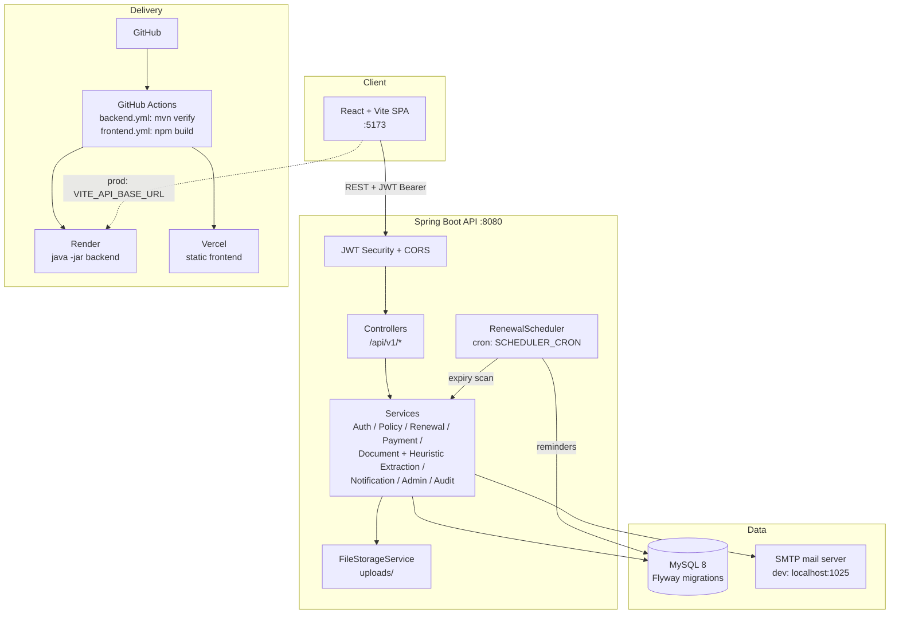

# Architecture

Runtime ports: backend Spring Boot `8080`, frontend Vite dev server `5173`
(API proxy `/api` → `http://localhost:8080`, backend serves `/api/v1/*`).

```mermaid
flowchart TB
    subgraph Client
        UI[React + Vite SPA<br/>:5173]
    end

    subgraph Backend["Spring Boot API :8080"]
        CTRL[Controllers<br/>/api/v1/*]
        SVC[Services<br/>Auth / Policy / Renewal / Payment /<br/>Document + Heuristic Extraction /<br/>Notification / Admin / Audit]
        SCHED[RenewalScheduler<br/>cron: SCHEDULER_CRON]
        SEC[JWT Security + CORS]
        STORE[FileStorageService<br/>uploads/]
    end

    subgraph Data
        DB[(MySQL 8<br/>Flyway migrations)]
        MAIL[SMTP mail server<br/>dev: localhost:1025]
    end

    subgraph Delivery
        GH[GitHub]
        ACT[GitHub Actions<br/>backend.yml: mvn verify<br/>frontend.yml: npm build]
        RENDER[Render<br/>java -jar backend]
        VERCEL[Vercel<br/>static frontend]
    end

    UI -->|REST + JWT Bearer| SEC
    SEC --> CTRL
    CTRL --> SVC
    SVC --> DB
    SVC --> STORE
    SVC --> MAIL
    SCHED -->|expiry scan| SVC
    SCHED -->|reminders| DB

    GH --> ACT
    ACT --> RENDER
    ACT --> VERCEL
    UI -.->|prod: VITE_API_BASE_URL| RENDER
```
