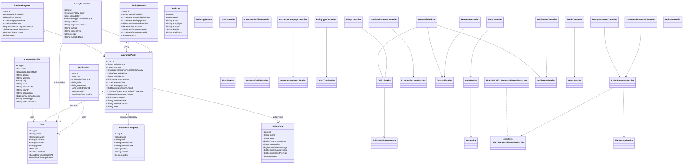

# Class Diagram

Mirrors the actual backend: `model/entity`, `model/enums`, `service`,
`repository`, `controller`, `security`, `storage`, `scheduler` packages.

```mermaid
classDiagram
    class User {
        +Long id
        +String email
        +String password
        +String firstName
        +String lastName
        +String phone
        +Role role
        +boolean enabled
        +LocalDateTime createdAt
        +LocalDateTime updatedAt
    }
    class CustomerProfile {
        +Long id
        +User user
        +LocalDate dateOfBirth
        +String gender
        +String address
        +String city
        +String state
        +String postalCode
        +String country
        +String occupation
        +BigDecimal annualIncome
        +String idProofType
        +String idProofNumber
    }
    class InsuranceCompany {
        +Long id
        +String name
        +String code
        +String contactEmail
        +String contactPhone
        +String address
        +String website
        +boolean active
    }
    class PolicyType {
        +Long id
        +String name
        +String code
        +PolicyCategory category
        +String description
        +BigDecimal minCoverage
        +BigDecimal maxCoverage
        +BigDecimal basePremium
        +boolean active
    }
    class InsurancePolicy {
        +Long id
        +String policyNumber
        +User customer
        +InsuranceCompany insuranceCompany
        +PolicyType policyType
        +String policyName
        +PolicyCategory category
        +LocalDate startDate
        +LocalDate expiryDate
        +BigDecimal premiumAmount
        +PremiumFrequency premiumFrequency
        +BigDecimal coverageAmount
        +PolicyStatus status
        +String nomineeName
        +String nomineeContact
        +String notes
    }
    class PremiumPayment {
        +Long id
        +InsurancePolicy policy
        +BigDecimal amount
        +LocalDate paymentDate
        +LocalDate dueDate
        +PaymentMethod paymentMethod
        +String transactionReference
        +PaymentStatus status
        +String notes
    }
    class PolicyRenewal {
        +Long id
        +InsurancePolicy policy
        +LocalDate previousExpiryDate
        +LocalDate newExpiryDate
        +BigDecimal renewalPremium
        +RenewalStatus status
        +LocalDateTime requestedAt
        +LocalDateTime processedAt
        +String remarks
    }
    class PolicyDocument {
        +Long id
        +InsurancePolicy policy
        +User uploadedBy
        +DocumentType documentType
        +String fileName
        +String originalFileName
        +String filePath
        +String contentType
        +Long fileSize
        +String extractedText
    }
    class Notification {
        +Long id
        +User user
        +NotificationType type
        +String title
        +String message
        +Long relatedPolicyId
        +boolean read
        +LocalDateTime readAt
    }
    class AuditLog {
        +Long id
        +Long userId
        +String action
        +String entityType
        +String entityId
        +String details
        +String ipAddress
    }

    CustomerProfile "1" --> "1" User : user
    InsurancePolicy "N" --> "1" User : customer
    InsurancePolicy "N" --> "1" InsuranceCompany : insuranceCompany
    InsurancePolicy "N" --> "1" PolicyType : policyType
    PremiumPayment "N" --> "1" InsurancePolicy : policy
    PolicyRenewal "N" --> "1" InsurancePolicy : policy
    PolicyDocument "N" --> "1" InsurancePolicy : policy
    PolicyDocument "N" --> "0..1" User : uploadedBy
    Notification "N" --> "1" User : user

    class AuthService
    class UserService
    class CustomerProfileService
    class InsuranceCompanyService
    class PolicyTypeService
    class PolicyService
    class PremiumPaymentService
    class RenewalService
    class PolicyDocumentService
    class PolicyDocumentExtractionService {
        <<interface>>
    }
    class HeuristicPolicyDocumentExtractionService
    class NotificationService
    class AdminService
    class AuditLogService
    class FileStorageService
    class JwtService
    class PolicyNumberGenerator
    class RenewalScheduler

    HeuristicPolicyDocumentExtractionService ..|> PolicyDocumentExtractionService
    PolicyDocumentService --> PolicyDocumentExtractionService
    PolicyDocumentService --> FileStorageService
    AuthService --> JwtService
    PolicyService --> PolicyNumberGenerator
    RenewalScheduler --> PolicyService
    RenewalScheduler --> RenewalService
    RenewalScheduler --> NotificationService

    class AuthController
    class UserController
    class CustomerProfileController
    class InsuranceCompanyController
    class PolicyTypeController
    class PolicyController
    class PremiumPaymentController
    class RenewalController
    class PolicyDocumentController
    class DocumentDownloadController
    class NotificationController
    class AdminController
    class HealthController

    AuthController --> AuthService
    UserController --> UserService
    CustomerProfileController --> CustomerProfileService
    InsuranceCompanyController --> InsuranceCompanyService
    PolicyTypeController --> PolicyTypeService
    PolicyController --> PolicyService
    PremiumPaymentController --> PremiumPaymentService
    RenewalController --> RenewalService
    PolicyDocumentController --> PolicyDocumentService
    DocumentDownloadController --> PolicyDocumentService
    NotificationController --> NotificationService
    AdminController --> AdminService
```
